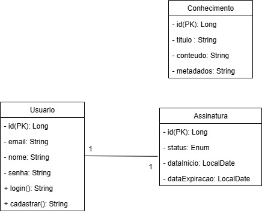
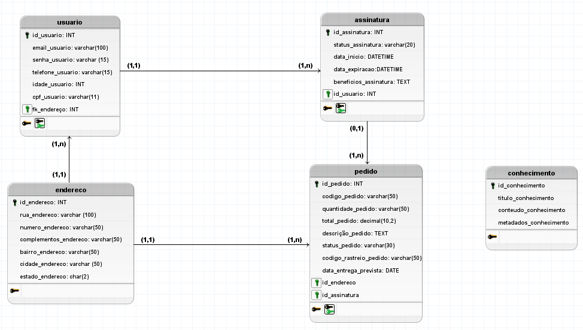

<div align= "center">


  
#  API  🌬️


O **SOPRO** é uma solução de tecnologia assistiva focada em devolver a autonomia de comunicação a indivíduos com mutismo ou limitações motoras severas. Esta API é o motor que gere a inteligência, a segurança e os dados por trás da plataforma, permitindo a conversão de inputs físicos em voz sintetizada e a gestão de perfis de utilizador.

```Se quiser ver uma documentação mais detalhada sobre a arquitetura:```

[](https://app.gitbook.com/invite/3BzJD9kc8XUB2pCNxAEC/kKoTDjNlltVAsoU7THWY)


## 📌 Funcionalidades principais

 **Gestão de utilizadores:** Registo e autenticação segura de perfis.
 **Controle de assinaturas:** Monitorização de acesso e validade dos planos dos utilizadores.
 **Base de conhecimento:** Repositório de metadados e conteúdos para suporte à comunicação assistida.
 **Segurança robusta:** Implementação de Spring Security com suporte a OAuth2 Authorization Server.

## 🏗️ Arquitetura do sistema

O projeto segue o padrão **MVC** (Model-View-Controller) para garantir a separação de responsabilidades e a escalabilidade do sistema.

### Diagrama de Classes (UML)
Abaixo encontra-se a modelagem das entidades principais: `Usuario`, `Assinatura` e `Conhecimento`.


  


## DER



## 🛠️ Stack tecnológica

 **Linguagem:** Java 21.
 **Framework:** Spring Boot 4.0.6.
 **Persistência:** Spring Data JPA.
 **Banco de Dados:** MySQL.
 **Segurança:** Spring Security & OAuth2.

 </div>

## Como Executar o projeto

### 1. Pré-requisitos
 Java 21 instalado.
 MySQL Server em execução.
 Maven (ou utilizar o Wrapper incluído).

</div>

### 2. Variáveis de ambiente
Configura o acesso ao banco de dados criando um ficheiro `.env` na raiz do projeto seguindo o modelo abaixo:

```env
DB_HOST=localhost
DB_PORT=3306
DB_NAME=sopro_db
DB_USER=root
DB_PASSWORD=suasenha

```

<div align= "center"> Criado com 💙 pela equipe do Back-end. </div>
