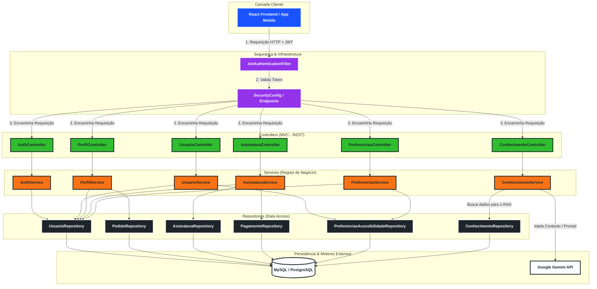
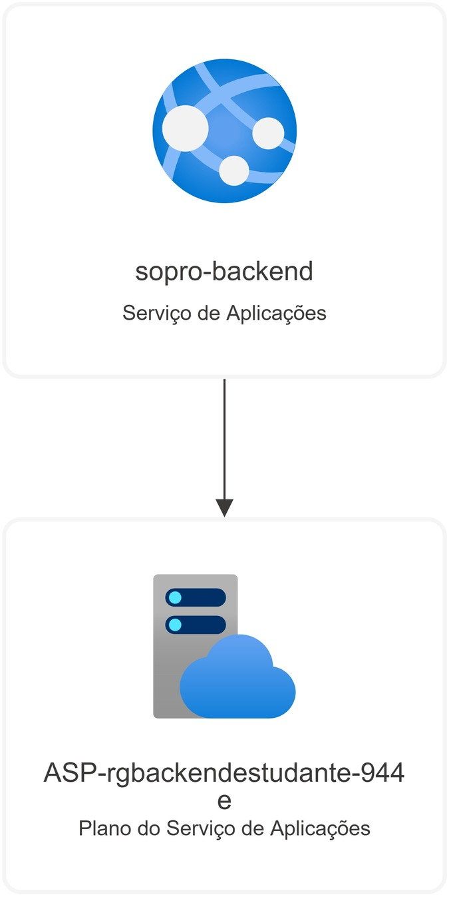
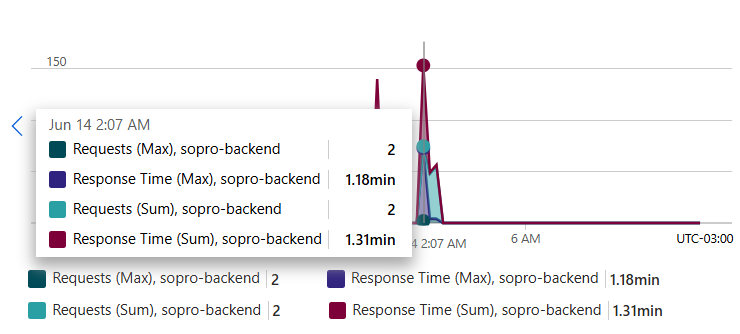
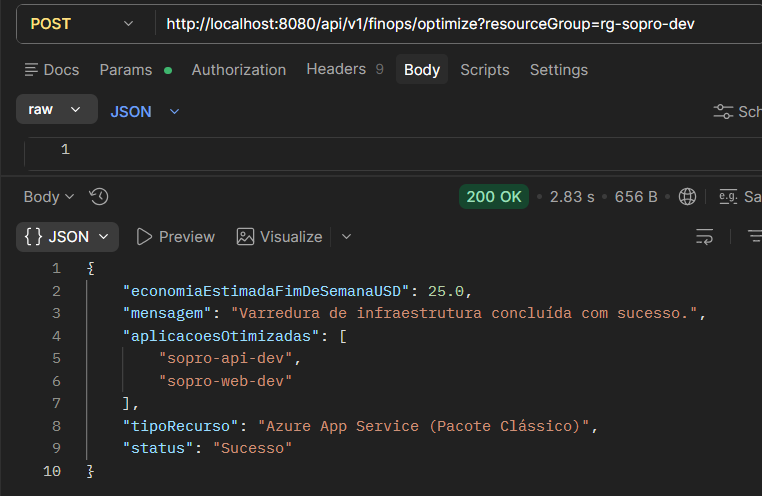

<div align= "center">


  
#  API  🌬️


A **Sopro** é uma solução de tecnologia assistiva focada em devolver a autonomia de comunicação a indivíduos com mutismo ou limitações motoras severas. Esta API é o motor que gere a inteligência, a segurança e os dados por trás da plataforma, permitindo a conversão de inputs físicos em voz sintetizada e a gestão de perfis de utilizador.

```Se quiser ver uma documentação mais detalhada sobre a arquitetura:```

[](https://app.gitbook.com/o/3BzJD9kc8XUB2pCNxAEC/s/jGShUQkZLDYVFAp0pbGV/)


## 📌 Funcionalidades principais

 **Gestão de utilizadores:** Registo e autenticação segura de perfis.
 **Controle de assinaturas:** Monitorização de acesso e validade dos planos dos utilizadores.
 **Base de conhecimento:** Repositório de metadados e conteúdos para suporte à comunicação assistida.
 **Segurança robusta:** Implementação de Spring Security com suporte a OAuth2 Authorization Server.

## 🏗️ Arquitetura do sistema

O projeto segue o padrão **MVC** (Model-View-Controller) para garantir a separação de responsabilidades e a escalabilidade do sistema.



  
> <details>
> <summary>Fluxo Cloud</summary>
>   
> 
> 
> </details>


## DER


## 🛠️ Stack tecnológica

 **Linguagem:** Java 21.
 **Framework:** Spring Boot 4.0.6.
 **Persistência:** Spring Data JPA.
 **Banco de Dados:** MySQL.
 **Segurança:** Spring Security & OAuth2.


 ## 🌐 Infraestrutura e hospedagem (Azure App Services)

O ambiente de produção do backend do projeto Sopro utiliza o **Azure App Services** para hospedagem da API em Spring Boot. Durante os ciclos de teste (Sprint 3), foram documentados comportamentos específicos da infraestrutura que impactam diretamente os indicadores de performance do sistema.

### Análise de latência e "Cold Start"

Identificou-se um comportamento de **Cold Start (Inicialização a Frio)** nas janelas de inatividade da aplicação. Como a API foi construída utilizando a stack Java 21+ Spring Boot, o processo de inicialização do container e carregamento do contexto do Spring exige um consumo inicial considerável de CPU e memória.

 ```Evidência: Em análises de telemetria, registrou-se um pico onde apenas **2 requisições** resultaram em um *Response Time (Max)* de **1.18 minutos** após um período de ociosidade do servidor.```
 
``` Causa raiz: O plano de serviço atual (camada gratuita/básica) coloca a aplicação em estado de hibernação (*idling*) quando não há tráfego constante. A primeira requisição subsequente precisa acordar a instância, resultando na latência observada. ```
 
 ```Comportamento normalizado:** Após a inicialização inicial (aquecimento do ambiente), o tempo de resposta estabiliza-se na casa dos milissegundos para as requisições seguintes.```



##  FinOps: Governança e otimização de custos (Azure App Services)

O projeto **Sopro** conta com um ecossistema integrado de **FinOps (Cloud Financial Operations)** desenvolvido nativamente no backend em Spring Boot. O objetivo principal deste módulo é aplicar políticas de governança automatizada sobre a infraestrutura em nuvem, eliminando o desperdício financeiro gerado por recursos ociosos fora do horário comercial.

### O problema: Desperdício em ambientes de desenvolvimento
Durante os ciclos de testes, microsserviços e APIs de ambientes de desenvolvimento (ex: `sopro-api-dev` e `sopro-web-dev`) costumam permanecer ativos de forma ininterrupta (24/7), mesmo em períodos de total inatividade, como madrugadas e finais de semana. 

###  A solução: varredura automatizada & inteligência de infraestrutura
O módulo monitora proativamente os grupos de recursos da Azure por meio de gatilhos temporais agendados (`@Scheduled` via CRON expressions) e requisições sob demanda.

 **Filtro por tags de governança**: O sistema varre os Resource Groups buscando recursos tagueados estritamente com as chaves `Environment: Development` ou `Environment: Test`.
 **Desalocação**: Ao interceptar instâncias ativas fora do horário operacional, o backend dispara chamadas assíncronas via SDK para interromper o ciclo de vida do recurso operacional (`webApp.stop()`), reduzindo o consumo de processamento de nuvem a **zero**.
 **Métricas de saving financeiro**: A API calcula instantaneamente a projeção matemática de economia gerada pela interrupção nas janelas de ociosidade (estimando um impacto de redução de custos fixos por hora por máquina alocada) e retorna relatórios estruturados de auditoria para o negócio.

### 📊 Exemplo prático (Retorno da API)



   </div>

## Como executar o projeto

### 1. Pré-requisitos
 Java 21 instalado.
 MySQL Server em execução.
 Maven (ou utilizar o Wrapper incluído).

</div>

### 2. Variáveis de ambiente
Configura o acesso ao banco de dados criando um ficheiro `.env` na raiz do projeto seguindo o modelo abaixo:

```env
DB_HOST=localhost
DB_PORT=3306
DB_NAME=sopro_db
DB_USER=root
DB_PASSWORD=suasenha

```

<div align= "center"> Desenvolvido com 💙 e muito café pela equipe do Back-end - Instituto PROA, 2026 </div>
